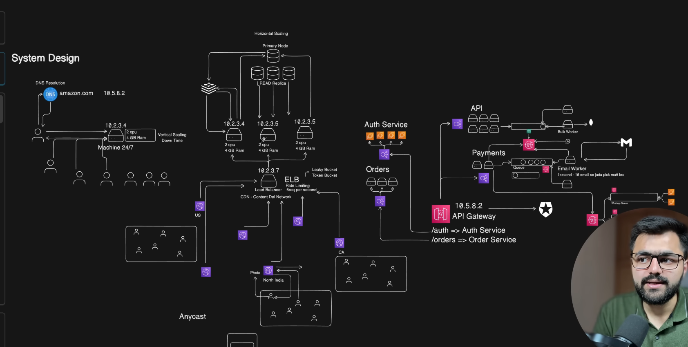
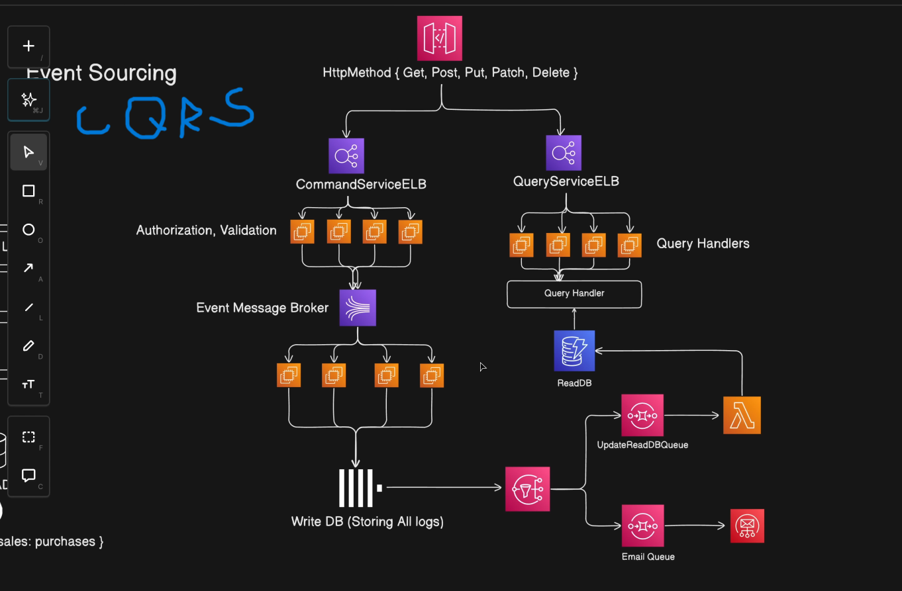
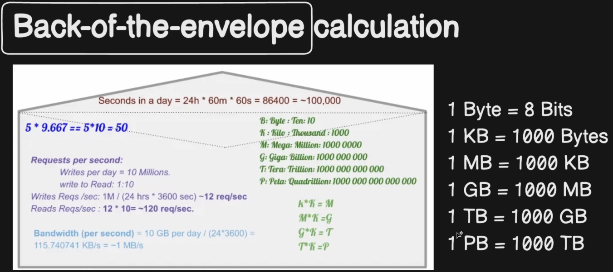

# System Design - Basics : Scaling (Horizontal, Vertical), Event Sourcing, CQRS

  

## 1. Horizontal Scaling (Scale Out)

- Definition: Adding more machines/instances to handle increased load
- Key Points:
    - ➕ Add more servers to distribute traffic
    - ➕ Better fault tolerance (if one fails, others continue)
    - ➕ Good for distributed systems & microservices
    - ➕ Practically unlimited scaling
    - ➖ Requires load balancer (e.g., NGINX)
    - ➖ More complex system design (data consistency, networking)
- Example: Adding more app servers behind a load balancer

## 2. Vertical Scaling (Scale Up)

- Definition: Increasing resources or capacity (CPU, RAM, storage) of a single machine/ hardware or software component
- Key Points:
    - ➕ Simple to implement
    - ➕ No major architecture changes
    - ➕ Easier data consistency
    - ➖ Hardware limit exists
    - ➖ Single point of failure
    - ➖ Downtime often required for upgrades
- Example: Upgrading a database server from 8GB RAM to 64GB RAM

### Quick Comparison

| Feature                       | Horizontal       | Vertical                 |
| ----------------------------- | ---------------- | ------------------------ |
| Scaling Method                | Add machines     | Add power to one machine |
| Fault Tolerance               | High             | Low                      |
| Limit                         | Almost unlimited | Hardware limit           |
| Complexity                    | High             | Low                      |
| Cost Efficiency (large scale) | Better           | Expensive at high scale  |

### 💡 Rule of Thumb

- Start with vertical scaling (early stage systems)
- Move to horizontal scaling for high-traffic, large-scale systems

---

## 3. Event Sourcing

- Event Sourcing is an architectural pattern where every change to application state is stored as an immutable sequence of events, instead of just storing the latest state
- Event Storage:
    - Append-only log (immutable)
    - Events are never updated or deleted
    - Often implemented using systems like Apache Kafka or custom event databases

- Why Use Event Sourcing?
    1. Full Audit Trail : Every change is recorded. Useful in: Banking, Financial systems, Compliance-heavy domains
    2. Time Travel / Replay : You can reconstruct state at any point in time.
    3. Debugging & Analytics : Replay events to: Rebuild projections, Fix bugs, Build new features from historical data

- Example : E-commerce Order
    - Instead of: OrderStatus = Shipped
    - Store: OrderPlaced > PaymentProcessed > OrderPacked > OrderShipped

- Pros
    - Complete history
    - Easy debugging
    - Enables event-driven architecture
    - Works well with microservices
- Cons
    - More complex than CRUD
    - Event versioning is hard
    - Storage grows indefinitely
    - Requires careful schema evolution

## 4. CQRS (Command Query Responsibility Segregation)

**CQRS with Event Sourcing**
  

- CQRS is a system design pattern that separates write operations (Commands) from read operations (Queries)
- This is genrally used for Complex system only
- It separates the system into two parts: one for handling writes (commands) and one for handling reads (queries)
- Commands change the system state and typically generate events that are stored as the source of truth
- These events are then used to update a separate read model optimized for fast queries
- The query side never modifies data; it only reads from the read database
- This separation improves scalability and performance but introduces eventual consistency between writes and reads.

- Why it is done ?
    - CQRS is done to improve scalability and performance by separating read and write workloads, especially in systems where reads are much heavier than writes
    - It also helps when the domain logic for writes is complex but reads need to be simple and fast.

- Pros:
    - It allows independent scaling of read and write services, optimizes databases differently for each workload, supports event-driven architectures, and improves maintainability for complex domains
    - It also works well with event sourcing and provides clearer separation of concerns.

- Cons:
    - It increases architectural complexity, requires more infrastructure (message brokers, separate databases), and introduces eventual consistency between write and read models
    - Debugging and testing become harder due to asynchronous flows.

- Tradeoff:
    - You gain scalability, flexibility, and performance at the cost of higher system complexity and operational overhead
    - CQRS is powerful for large, distributed, high-scale systems but often unnecessary for simple CRUD applications.

## 5. Back of Envelope Calculation

  

- It is a rough estimation technique used to validate whether a system can handle expected scale — before going deep into architecture
- It helps you answer: Will this system realistically work at this scale?
- The goal is not precision — it’s order-of-magnitude correctness
- It Involves estimate of key numbers like: Number of users, Requests per second (RPS), Data generated per day, Storage required, Bandwidth needed, Memory and server capacity

- Why It’s Important
    - Prevents unrealistic designs
    - Helps choose correct database, cache, or infrastructure
    - Shows scalability awareness in interviews
    - Identifies bottlenecks early

- **Example** :
    - If a system has: 10 million daily active users and Each makes 10 requests/day
    - That’s: 100M requests/day ≈ ~1,200 requests/second
    - Now you can estimate : How many servers needed, How much load per server, How much storage per year
