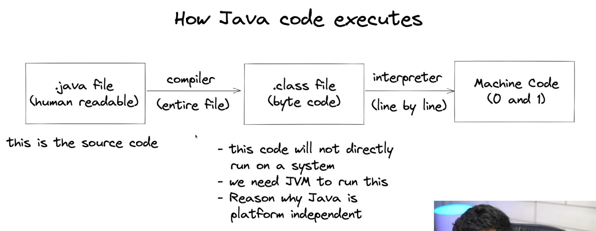
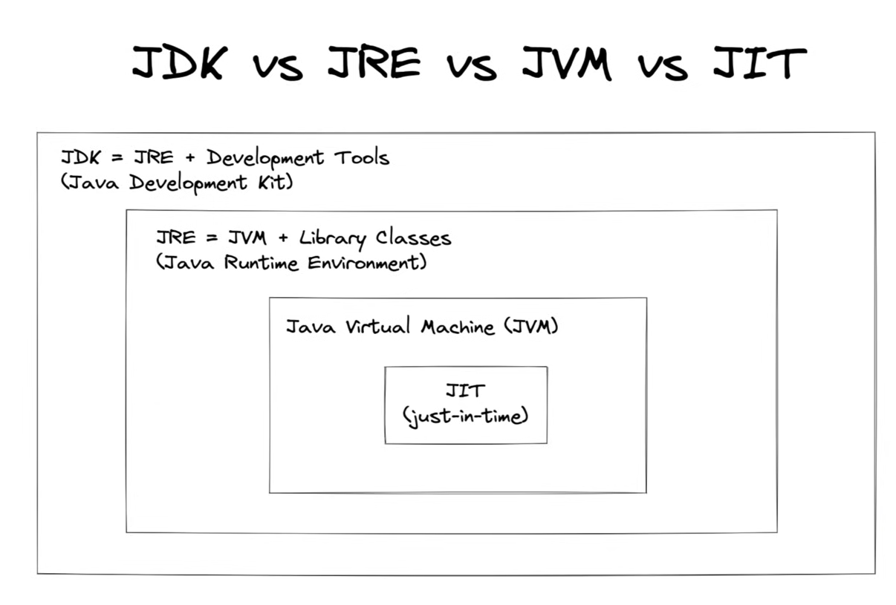
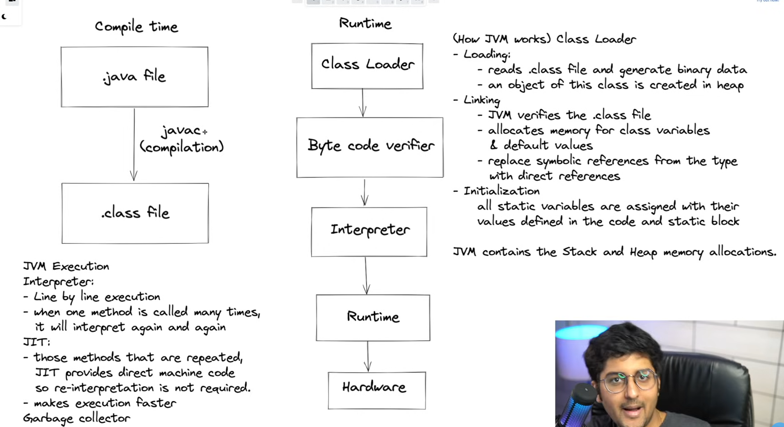
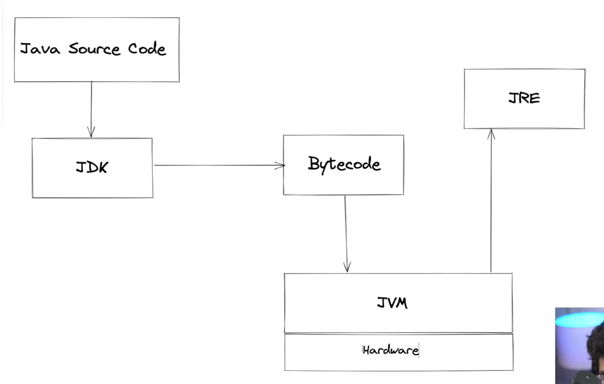

# Basics of Java:

1. How Java code executes:
     

2. Java is Platform independent

    - It means that byte code can run on all operating systems
    - We need to convert source code to machine code so computer can understand
    - Compiler helps in doing this by turning it into executable code
    - this executable code is a set of instructions for the computer
    - After compiling C/C++ code we get .exe file which is platform dependent
    - In Java we get bytecode, JVM converts this to machine code
    - Java is platform-independent but JVM is platform dependent

3. JDK vs JRE vs JVM vs JIT
     

4. JDK (Java Development Kit)

-   Provides environment to develop and run the Java program.
-   It is a package that includes:
    -   Development tools – to provide an environment to develop your program.
    -   JRE – to execute your program.
    -   A compiler – javac
    -   Archiver – jar
    -   Docs generator – javadoc
    -   Interpreter / loader

 
5. JRE (Java Runtime Environment)

-   It is an installation package that provides an environment to only run the program.
-   It consists of:
    -   Deployment technologies
    -   User interface toolkits
    -   Integration libraries
    -   Base libraries
    -   JVM (Java Virtual Machine)
-   After we get the .class file, the next things happen at runtime:
    -   Class loader loads all classes needed to execute the program.
    -   JVM sends code to Byte code verifier to check the format of code.

 
6. Java Execution :
      

7. Working of Java Architecture
     
