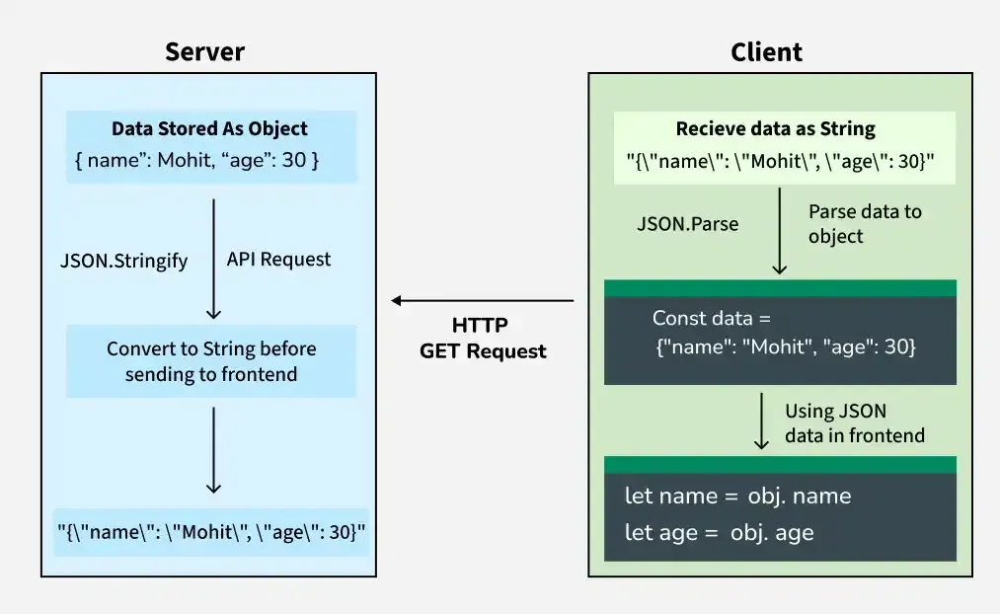

# Basic terminologies : Good to know

1. Rendering the Web Page

    - How Rendering Works :

        - HTML to Visuals: The browser reads the HTML (Hypertext Markup Language) to structure the content of the page. This includes headers, paragraphs, and links.
        - CSS Styling: The browser then reads CSS (Cascading Style Sheets), which adds color, layout, fonts, and spacing.
        - JavaScript Magic: If the page has interactive elements (like selecting pizza toppings or checking out), JavaScript is loaded. It makes sure these dynamic features work smoothly.

    - How the Browser Renders :
        - DOM (Document Object Model): The browser creates a representation of the page in memory (called DOM), using the HTML & CSS.
        - Rendering Pipeline: The browser processes this data & draws it on your screen, showing the pizza menu, along with all the interactive elements.

2. Web Security: Protecting You on the Internet

    - **Encryption** (SSL/TLS - Transport Layer Security/Secure Sockets Layer) : Encrypts data between your browser and server, keeping sensitive info like passwords and credit cards safe from hackers.

    - **Authentication and Authorization** :

        - Authentication: This is the process of proving who you are or Verifies your identity (e.g., logging in)).
        - Authorization: Once authenticated, Grants access based on your identity (e.g., view orders)

    - **Cookies and Sessions** : Cookies store small data like login info. Sessions help websites remember who you are while you're logged in

    - **XSS & CSRF Attacks:** (Cross-Site Scripting (XSS) and Cross-Site Request Forgery (CSRF)) : These are common security threats:
        - XSS : Allows attackers to inject malicious scripts into web pages to steal info
        - CSRF : Tricks users into making unwanted requests, like changing account settings without their consent.
        - Web Developers prevent these using input validation, secure headers and enabling Content Security Policy (CSP).

3. Web Protocols: Communication Between Browser and Server

    - HTTP/HTTPS (Hypertext Transfer Protocol / Secure)
    - TCP/IP (Transmission Control Protocol/Internet Protocol)
    - TLS/SSL (Transport Layer Security/Secure Sockets Layer)

4. Full Process in Action (From user Searching to Getting ouput) :

    - User type www.xyz.com into the browser
    - DNS translates the URL (www.xyx.com) to an IP address (192.0.2.1) using URL Parsing and DNS Lookup
    - HTTP(S) request is sent to server
    - Server checks its database for the requested data (like the xyz website menu)
    - Server sends the HTML, CSS and JavaScript back to browser
    - Browser uses HTML, CSS and JavaScript to render the page and display the website details
    - If applicable, SSL/TLS encrypts your communication and cookies/sessions keep you logged in for future visits
    - Your secure, interactive xyz website menu is ready to explore!

5. **Frameworks and Libraries** : pre-written pieces of code that help developers build websites faster. e.g.,:

    - React : JavaScript library for building user interfaces.
    - Bootstrap : CSS framework that helps you create responsive, mobile-friendly websites.
    - Node.js : JavaScript runtime for building back-end applications.

6. **API (Application Program Interface)** :
   <br>

    - It is like a middleman between two systems, allowing them to communicate and exchange data.
    - It connects the front end and back end, making apps work smoothly behind the scenes.
    - Why APIs Matter for Full Stack Developers

    ```
    - Fetch Live Data: Use JavaScript to call APIs and display real-time data (like profiles, products, or orders) on the frontend.
    - Build Backend APIs: Create APIs that handle logic, access databases, and send responses to the frontend.
    - Integrate Services: Connect with third-party APIs (e.g., Stripe, Google Maps, Auth0) to add features like payments, maps, or social logins.
    ```

7. **JSON (JavaScript Object Notation)** :

    - It is the common format used for sending and receiving data between frontend and backend.
    - It’s lightweight, human-readable, and easy for both systems to understand—making it the universal language for web data.
    - Example:

    ```
    {
    "name": "Sara",
    "email": "sara@example.com",
    "isPremiumUser": true
    }
    ```

    - Each piece of data is a key-value pair. Text values are inside quotes (" ").
    - Booleans (true/false) and numbers don’t need quotes
    - Arrays and nested objects are also supported
      <br><br>

    - As a full stack developer, JSON will be everywhere. Here is how:

    ```
    - Receive Data from APIs: Get user profiles, product lists, orders, etc., all in JSON format.
    - Send Data to the Backend: Forms, login info, and checkout details are often submitted as JSON.
    - Store Data in Frontend Apps: Keep session info, cart data, or UI settings in JSON inside local storage or state.
    ```

8. **MERN : (MongoDB, Express, React, Node)**
    - This collection of technologies represents a popular JavaScript stack used for building full-stack web applications
    - MongoDB : A NoSQL database used to store application data in flexible, JSON-like documents.
    - Express.js : A lightweight Node.js web framework used to build the server and handle HTTP requests.
    - React.js : A front-end JavaScript library for building dynamic user interfaces (UI) in a single-page application (SPA).
    - Node.js :A JavaScript runtime that lets you run JavaScript on the server side.
