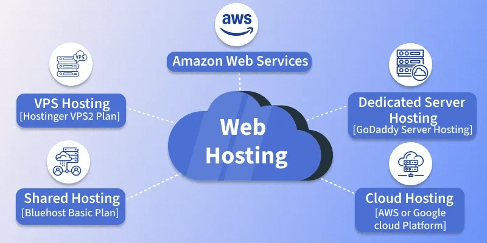
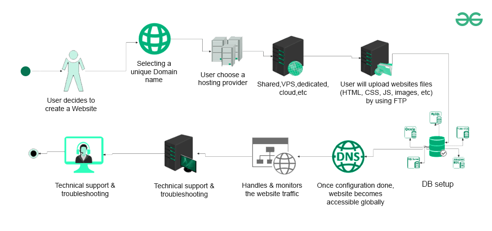

# Web Hosting

1. Web hosting is what makes your website visible on the internet.

    - It stores your website’s files on special computers called servers and delivers them to visitors when they type in your domain name.
    - Web hosting allows websites to be online 24/7 by storing files (images, text, code) on servers.
    - When someone enters your domain (like⁣ - ⁣www.geeksforgeeks.org), the server sends the website files to their browser.
      <br>

2. Hosting a Website: Complete Setup and Maintenance Flow
   <br><br>

    ```
    1. Domain Registration : Choose a unique domain name as your website’s address (e.g., www.example.com).

    2. Choose a Hosting Provider : Pick a hosting service based on your site's storage, bandwidth, and support needs.

    3. Server Configuration : Hosting provider allocates server space (shared, VPS, dedicated, or cloud).

    4. Uploading Website Files : Upload HTML, CSS, JS, and media files using FTP or a control panel.

    5. Database Setup : Create a database (e.g., MySQL) for storing dynamic content.

    6. DNS Configuration : Configure DNS to link your domain name to your hosting server.

    7. Website Accessibility : Once DNS propagates, your site becomes accessible globally.

    8. Ongoing Maintenance : Update content, software, and security regularly; perform backups.

    9. Handle Traffic : Monitor and scale hosting resources based on visitor volume.

    10. Technical Support & Troubleshooting : Resolve site issues like downtime or slow performance promptly.
    ```

3. Type of Hosting

    1. Shared Hosting

    - Description: Multiple websites share the same server and its resources.
    - Best for: Beginners and small websites with low traffic.
    - Pros: Low cost, easy to set up.
    - Cons: Limited performance and control; affected by other sites on the same server.

    2. VPS Hosting (Virtual Private Server)

    - Description: One physical server is divided into several virtual servers, each acting independently.
    - Best for: Medium-sized websites needing better performance and more control.
    - Pros: More control and resources than shared hosting.
    - Cons: Higher cost than shared hosting; requires some technical skills.

    3. Cloud Hosting

    - Description: Websites run on a network of connected virtual and physical cloud servers.
    - Best for: Websites with unpredictable or growing traffic.
    - Pros: Scalable, reliable, good uptime.
    - Cons: Can become expensive; less control than dedicated hosting.

    4. Dedicated Hosting

    - Description: You rent an entire physical server dedicated to your website only.
    - Best for: Large businesses and high-traffic websites.
    - Pros: Maximum control, high performance, and full resource allocation.
    - Cons: Expensive and requires advanced technical knowledge to manage.

4. Websites to Help you During (Or After) the Above Flow
   | **Purpose** | **Tool Name** | **Website Link** | **Description** |
   | ---------------------------------- | ---------------------- | ---------------------------------------------------------- | --------------------------------------------------------------- |
   | Check Domain Availability | GoDaddy Domain Checker | [https://www.godaddy.com/](https://www.godaddy.com/) | Helps you pick the right domain for your business/blog. |
   | DNS Propagation Status | WhatsMyDNS | [https://www.whatsmydns.net/](https://www.whatsmydns.net/) | View current DNS propagation status. |
   | DNS Lookup (Public Records) | MXToolbox | [https://mxtoolbox.com/](https://mxtoolbox.com/) | Lookup MX, A, CNAME, SPF, and other DNS records publicly. |
   | Global Page Load & Uptime Check | GeoPeeker | [https://www.geopeeker.com/](https://www.geopeeker.com/) | Check how your site appears from multiple geographic locations. |
   | Website Uptime Monitoring | UptimeRobot | [https://uptimerobot.com/](https://uptimerobot.com/) | Monitor site uptime with downtime alerts. |
   | Page Load Speed (Performance Test) | GTmetrix | [https://gtmetrix.com/](https://gtmetrix.com/) | Analyze page load speed and performance suggestions. |
   | Website Performance by Location | Pingdom | [https://tools.pingdom.com/](https://tools.pingdom.com/) | Test site performance from global locations. |
   | DNS, WHOIS, and Web Info Checker | DNSChecker | [https://dnschecker.org/](https://dnschecker.org/) | Combines DNS lookup, propagation, WHOIS, and IP tools. |
   | WHOIS and DNS Records | ICANN WHOIS | [https://lookup.icann.org/](https://lookup.icann.org/) | Official WHOIS data from the domain registrar. |
   | IP, Hostname, and Geolocation Info | IPInfo | [https://ipinfo.io/](https://ipinfo.io/) | Shows IP address, hosting provider, ASN, and geolocation info. |
