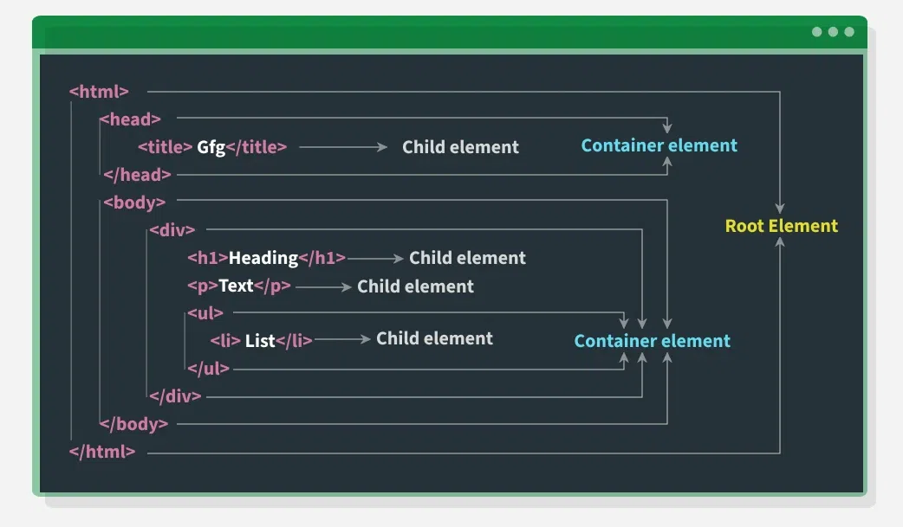
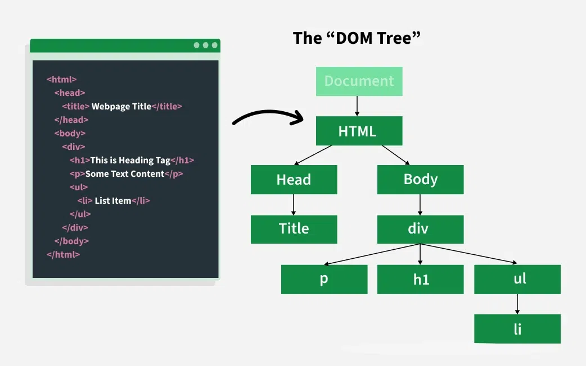

# DOM (Document Object Model)

-   The HTML DOM is the foundation of modern web interactivity, enabling over 90% of dynamic behavior seen on websites today.
-   It acts as a structured representation of an HTML document, allowing developers to programmatically access, modify, and control the content and structure of a web page using JavaScript.
-   From real-time form validation to interactive UI elements, mastering the HTML DOM is essential for building responsive and user-driven web applications.
-   HTML DOM is a tree structure, where each HTML tag becomes a node in the hierarchy.

      

      
      
      
 

### Why is DOM Required?

1. **Dynamic Content Updates**: Without reloading the page, the DOM allows content updates (e.g., form validation, AJAX responses). JavaScript can directly access and modify HTML elements using the DOM. (e.g. `document.getElementById("message").textContent = "Updated content!";
`)
2. **User Interaction**: It makes your webpage interactive (e.g., responding to button clicks, form submissions). The DOM allows you to attach event listeners to elements (e.g., `document.querySelector("button").addEventListener("click", function () {alert("Button was clicked!"); });
`)
3. **Flexibility**: Developers can add, modify, or remove elements and styles in real-time.
4. **Cross-Platform Compatibility**: It provides a standard way for scripts to interact with web documents, ensuring browser compatibility.
    - The DOM is a W3C standard, supported by all modern browsers.
    - This means developers can write browser-independent code to access and manipulate content.

### How the DOM Works?

-   The DOM connects your webpage to JavaScript, allowing you to:
    1. Access elements (like finding an `<h1>` tag).
    2. Modify content (like changing the text of a `
` tag).
    3. React to events (like a button click).
    4. Create or remove elements dynamically.

### Types of DOM

-   The DOM is seperated into 3 parts:
    1. **Core DOM:** It is standard model for all document types(All DOM implementations must support the interfaces listed as "fundamental" in the code specifications).
    2. **XML DOM:** It is standard model for XML Documents( as the name suggests, all XML elements can be accessed through the XML DOM .)
    3. **HTML DOM:** It is standard model for HTML documents (The HTML DOM is a standard for how to get, change, add, or delete HTML elements.)

### Properties of the DOM

1. **Node-Based:** **Everything** in the DOM is represented as a node (e.g., element nodes, text nodes, attribute nodes).
2. **Hierarchical:** The DOM has a parent-child relationship, forming a tree structure.
3. **Live**: Changes made to the DOM using JavaScript are immediately reflected on the web page.
4. **Platform-Independent:** It works across different platforms, browsers, and programming languages.

### Winodws BOM (Browser Object Model )

1. window Object (BOM + DOM)
2. The window object represents the browser window or tab. It’s the global object in the browser environment.

3. The window object is the global browser environment, combining both:

    - BOM (browser control)
    - DOM (webpage control via document).

4. BOM Features via window and Access to browser tools like:
    - window.location (URL)
    - window.history (navigation)
    - window.navigator (browser info)
    - window.screen (screen size)

### Accessing data from DOM

1. JavaScript uses the DOM to access the document and its elements in the webpage using the API for the document or window .
2. E.g., the standard DOM specifies that the getElementsByTagName the method in the code below must return a list of all the `
` elements in the document

### DOM Data Types

-   When working with the DOM (Document Object Model), there are different types of data or building blocks used behind the scenes. Here’s what they mean in everyday terms:

    1. Document: Think of it as the entire webpage. It's like the starting point or the big box that holds everything you see on a website.
    2. Node: Anything on the webpage—like a heading, paragraph, image, or even some hidden parts—is called a node. It’s like a small part or piece of the whole page.
    3. Element: This is a specific type of node. It represents actual tags you write in HTML, like `
, 
, or `. These are the visible parts of the page.
    4. NodeList: Imagine you ask the page to give you all the buttons or all the paragraphs—it gives you a list of those items. That list is called a NodeList. It's like a group of nodes stored together.
