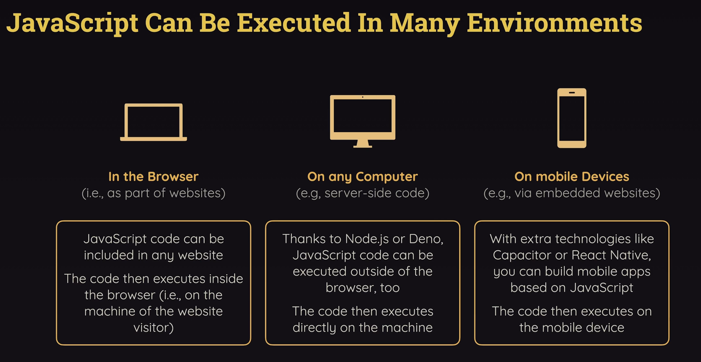

# ⚡ React vs Next.js

## 🔹 React

- It is a **JavaScript library** for building **UI components**. It is used to create Dynamics and interactive user interfaces.

- It is maintained by Facebook (Meta) in 2011 (Typescript was created by Microsoft in 2012 and Angular, Vue by Google in 2010)
- React is a JS library, but Anguler, Vue are JS framework
    - React is good at building UI, but in modern time it is highly unlike to use React alone
    - So, things like Routing (one page to another), HTTP calls, Managing application state, Internationalization, Form validation, Animations etc, differnt tools are used along with React

---

### Library vs Framwork

- `Library` :
    - A tool that provides specific functionality
    - It is like a single tool

- `Framework` :
    - A set of tools and guidelines for building apps
    - It is a tool-set (set of multiple tools)

---

- **What it does:**
    - Lets you build **reusable UI components** (buttons, forms, layouts, etc.)
    - Manages **state** (data inside components).
    - Handles **UI rendering** on the client (browser).

- **What it doesn’t do (alone):**
    - Routing (moving between pages)
    - Server-side rendering (SSR)
    - API endpoints
    - SEO optimization (since it’s client-side by default)

👉 React is the **core** building block, but you usually need **extra libraries** for a full app (e.g., React Router, Axios, Redux).

---

### JavaScript on Different environmnets

  

---

## 🔹 Next.js

- It is a **framework built on top of React**.

- IT is maintained by Vercel.

- **What it does:**
    - Everything React does, **plus**:
        - ✅ **File-based routing** (no need for React Router)
        - ✅ **Server-side rendering (SSR)** and **Static site generation (SSG)** for SEO & performance
        - ✅ **API routes** (backend endpoints inside the same app)
        - ✅ **Image optimization**
        - ✅ **Built-in deployment support (Vercel)**
        - ✅ **Full-stack capabilities** (you can build both frontend + backend in one project)

👉 Think of **Next.js as React + batteries included**.  
It takes React and adds all the missing “real-world app” features.

---

## 🔑 Analogy

- **React = Engine** of a car (it makes things move, but not enough to drive comfortably).
- **Next.js = Full Car** (engine + wheels + steering + navigation).

---

1. Learn **React first** (components, state, props, hooks).
    - Otherwise, Next.js will feel confusing.
2. Then move to **Next.js** → you’ll see it’s just React + more features.
