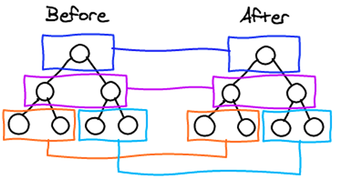

# React Diff Algorithm

<br><br>

## Virtual DOM :

- Based on the application code, React builds a tree of elements that describes how the written component should be rendered
- The nodes of this tree are stored as plain objects called elements
- After a user interaction that results in a state or props changes, React will generate a new tree of elements

## Reconciliation:

- Before updating the user interface, React uses a reconciliation algorithm to compare the new tree with the most recent tree to find out the most efficient way to update the user interface
- The user interface is not necessary a browser interface but can be an android/IOS application (React native or React IOS)
- The problem at this level is that the latest algorithms for solving this kind of problem have a complexity of O(n³)
- React uses heuristics to reduce the time of processing and to solve the problem in a linear time O(n)

### From the official documentation, there are two assumptions :

1. Different elements will produce different trees
    - React parses the tree using Breadth-first search (BFS). For a node of the tree, if the element type is changed, for example from ‘section’ to ‘div’
    - React will destroy all the sub-tree under that element & will reconstruct them from scratch
2. The developer can hint at which child elements may be stable across different renders with a key prop
    - This means by adding keys to children, React will be able to track changes

For example, given a component that contains the following code

```
<ul>
    <li>item 1</li>
    <li>item 2</li>
</ul>

// if in the future, a new element is inserted as follow :
<ul>
    <li>item 0</li>
    <li>item 1</li>
    <li>item 2</li>
</ul>
```

React will not be able to figure out that the two last elements are the same as in the original list & will update the interface in an inefficient way. This problem can be solved by adding keys to every child element as follow:

```
<ul>
    <li key=’1'>item 1</li>
    <li key=’2'>item 2</li>
</ul>
```
