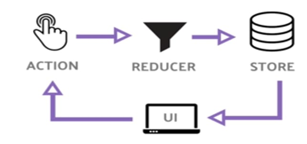

# Other Hooks : useContext, useRef, useReducer

## useContext

- This hook allows us to work with React's Context API, which itself is a mechanism to allow us to share data within its component tree without passing through props
- It basically removes prop-drilling

```
const ans = {
    right: '✅',
    wrong: '❌'
}

const AnsContext = createContext(ans);

function Exam(props) {
    return (
        // Any child component inside this component can access the value which is sent.
        <AnsContext.Provider value={ans.right}>
            <RightAns />
        </AnsContext.Provider>
    )
}

function RightAns() {
    // it consumes value from the nearest parent provider.
    const ans = React.useContext(AnsContext);

    return (
        <p>{ans}</p>
    )
    // previously we were required to wrap up inside the AnsContext.Consumer
    // but this useContext hook, gets rid of that.
}
```

## useRef :

- This hook allows us to create a mutable object. It is used, when the value keeps changes like in the case of useState hook, but the difference is, it doesn't trigger a re-render when the value changes
- The common use case of this is to grab HTML elements from the DOM

```
function App() {
    const myBtn = React.useRef(null);
    const handleBtn = () => myBtn.current.click();

    return (
        <button ref={myBtn} onChange={handleBtn}>
        </button>
    )
}
```

## useReducer

- It does very similar to setState, It's a different way to manage the state using Redux Pattern
- Instead of updating the state directly, we dispatch actions, that go to a reducer function, and this function figures out, how to compute the next state

<br><br>

```
function reducer(state, action) {
    switch (action.type) {
        case 'increment':
            return state + 1;
        case 'decrement':
            return state - 1;
        default:
            throw new Error();
    }
}

function useReducer() {
    // state is the state we want to show in the UI.
    const [state, dispatch] = React.useReducer(reducer, 0);

    return (
        <>
            Count : {state}
            <button onClick={() => dispatch({type: 'decrement'})}>-</button>
            <button onClick={() => dispatch({type: 'increment'})}>+</button>
        </>
    )
}
```
