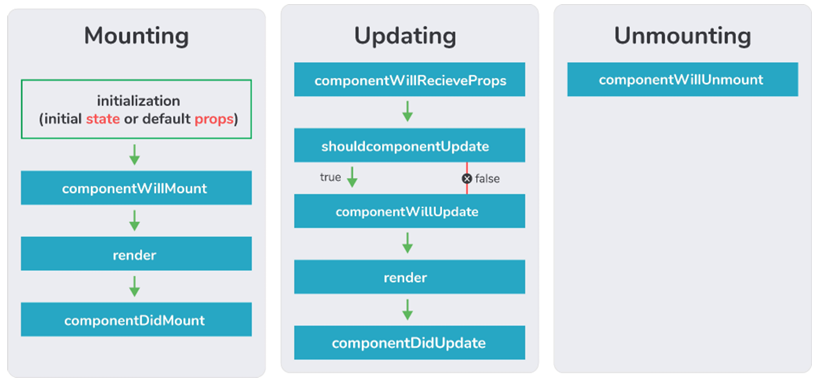

# Interview Questions

1.  What is JSX? (Oyo, Uber)
    - JSX is a XML-like syntax extension to ECMAScript (the acronym stands for JavaScript XML)
    - Basically it just provides syntactic sugar for the React.createElement() function, giving us expressiveness of JavaScript along with HTML like template syntax

2.  How to create components in React? (XPRate)
    - There are two possible ways to create a component
        - Function Components: This is the simplest way to create a component. Those are pure JavaScript functions that accept props object as first parameter and return React elements
        - Class Components: You can also use ES6 class to define a component

3.  When to use a class component over a functional component? (Google)
    - If the component needs state or lifecycle methods, then use class component; otherwise, use function component
    - However, from React 16.8, with the addition of Hooks, you could use state, lifecycle methods, and other features that were only available in-class components right in your function component.

4.  What is the difference between state and props? (Amazon)
    - Both props and state are plain JavaScript objects
    - While both hold information that influences the output of render, they are different in their functionality with respect to components
    - Props get passed to the component similar to function parameters, whereas the state is managed within the component similar to variables declared within a function

5.  Why should we not update the state directly? (Expedia)
    - If you try to update the state directly, then it won't re-render the component
        - Wrong : `this.state.message = 'Hello world'`
    - Instead use setState() method. It schedules an update to a component's state object - When the state changes, the component responds by re-rendering
        - Correct : `this.setState({ message: 'Hello World' })`
    - Note: You can directly assign to the state object either in the constructor or using the latest javascript's class field declaration syntax

6.  What are Synthetic Events in React.Js? (Gojek)
    - A synthetic event is a cross-browser wrapper around the browser’s native event
    - It has the same interface as the browser’s native event, including stopPropagation() & preventDefault(), except the events work identically across all browsers
    - It achieves high performance by automatically using event delegation
    - In actuality, React doesn’t attach event handlers to the nodes themselves
    - Instead, a single event listener is attached to the root of the document. When an event is fired, React maps it to the appropriate component element.

7.  What are Event Handlers in React.js? (Amazon)
    - Event handlers determine what action is to be taken whenever an event is fired
    - This could be a button click or a change in a text input
    - Essentially, event handlers are what make it possible for users to interact with your React app
    - Handling events with React elements is similar to handling events on DOM elements, with a few minor exceptions

8.  .What is the onClick handler in React? (Goldman Sachs)
    - The React onClick event handler enables you to call a function & trigger an action when a user clicks an element, such as a button, in your app
    - Event names are written in camelCase, so the Onclick event is written as onClick in a React app. In addition, React event handlers appear inside curly braces

        ```
        <button onClick={sayHello}>
        Say Hello
        <button>
        ```

9.  What are the different lifecycle methods in React? (Gojek)
    - Every component in React has lifecycle methods that we can tap into, to trigger changes at a particular phase of the life cycle.
    - Each component in react goes through three phases: Mounting, Updating & Unmounting

    <br><br>

10. What is the Difference Between Rendering And Mounting? (OYO)
    - Rendering: Process where React calls `render()` and returns React elements (virtual DOM) that describe what should appear in the UI. Happens on initial load and on every state or prop change
    - Mounting: Phase where the rendered elements are inserted into the real DOM for the first time
    - Lifecycle methods related to mounting:
        - `componentWillMount()` – called after `constructor()` and before `render()` _(deprecated in modern React)_
        - `componentDidMount()` – called after the component is rendered and added to the DOM
        - `componentWillUnmount()` – called just before the component is removed from the DOM (used for cleanup)

    - Key Difference:
        - Mounting occurs once when the component is first added to the DOM
        - Rendering can occur multiple times whenever state or props change

11. What are hooks in React? (Gojek)
    - Hooks are a new feature added in React v16.8
    - It allows using all React features without writing class components
    - e.g, before version 16.8, we need a class component to manage the state of a component
        - Now we can keep the state in a functional component using useState hook.

12. Why React hooks was introduced? (Amazon)
    - React Hooks were introduced to use state & lifecycle features in functional components, simplify logic reuse, avoid this issues & keep related logic organized
    - Avoid this complexity: Class components require handling this, which often causes bugs (e.g., in this.setState() or event handlers). Hooks remove this by using functional components
    - Reuse stateful logic easily: Hooks allow sharing logic between components without using complex patterns like HOCs or render props.
    - Better code organization: In class components, related logic is split across lifecycle methods (e.g., componentDidMount, componentDidUpdate). Hooks keep related logic together (e.g., inside useEffect)
    - Simpler and more optimized components: Functional components with Hooks are easier to minify and work better with features like hot reloading

13. How useState hook works? What is/are the arguments accepted by this hook and what is returned by the hook? (OYO)
    - useState hook is a function that is used to store state value in a functional component. It accepts an argument as the initial value of the state
    - It returns an array with 2 elements
    - The first element is the current value of the state
    - The second element is a function to update the state

14. How do React Components Communicate with each other? (Google)
    - Parent to Child : Using Props
    - Child to Parent : Using Callback

15. Name a few techniques to optimize React app performance. (Gojek)
    - Optimize React performance by preventing unnecessary re-renders, memoizing expensive calculations, keeping state localized & lazy loading components
        - useMemo() – Caches results of expensive computations so they only recompute when dependencies change
        - React.PureComponent / React.memo – Prevents unnecessary re-renders by doing shallow comparison of props and state
        - State Colocation – Keep state close to the component that actually uses it to avoid unnecessary parent re-renders
        - Lazy Loading – Load components only when needed using React.lazy and Suspense to reduce initial bundle size

16. What Are The Reasons Behind Re-Rendering In React? (Amazon)
    - Re-rendering of a component and its child components occurs when props or the state of the component has been changed
    - Re-rendering components that are not updated, affects the performance of an application

17. What is ReactDOM, and what is the Difference Between ReactDOM and React? (OYO)
    - Earlier ReactDOM was part of React but later React and ReactDOM were split into two different libraries
    - Basically, ReactDOM works like glue between React and the DOM
    - We can use it for one single thing: mounting with ReactDOM
    - ReactDOM.findDOMNode() which is another useful feature of ReactDOM can be used to access the DOM element

18. What is Redux? (Goldman Sachs)
    - Redux is a great way to store the entire application’s state in a single store
    - When your application is small, you wouldn’t be facing issues in handling the state
    - But when it starts growing you will find that state in various components is becoming unmanageable. Here Redux solves your problem
    - Redux mainly works on three components:
        - Action:
            - Actions are payloads of information that send data from the application to the store
            - Actions are the only source of information for the store. We send them to the store using the store.dispatch()
        - Reducer:
            - Reducer specifies how the applications’ state changes in response to actions sent to the store
            - Actions describe what happened, but it doesn’t describe how the application’s state changes
            - Basically, a reducer determines how the state will change to action
        - Store:
            - Store objects bring the action and reducer together
            - You can access the state via getState(); It allows the state to be updated via dispatch (action)
