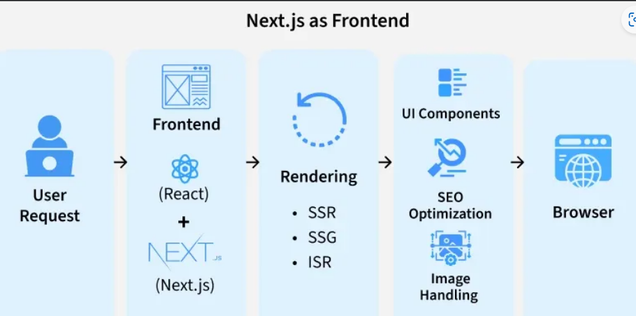
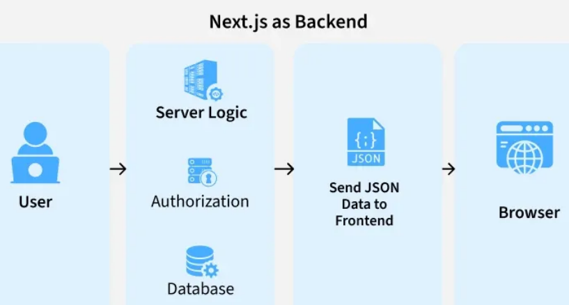
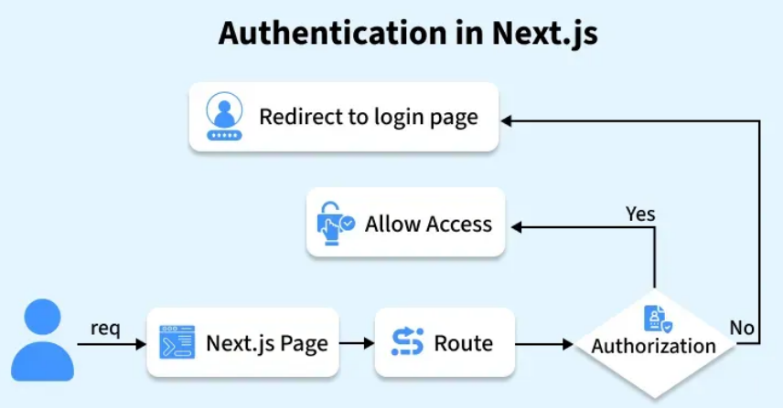

# Project folder Structure

## React + Vite + Backend (firebase/node)

```
my-fullstack-app/
│
├── OLD-CRA # delete once website is migrated
├── client/ # Frontend (React + Vite)
│ ├── public/
│ ├── src/
│ │ ├── assets/ # images, fonts
│ │ ├── components/ # reusable UI components
│ │ ├── pages/ # route-based pages
│ │ ├── hooks/ # custom hooks
│ │ ├── services/ # API calls (axios/fetch)
│ │ ├── context/ # global state (Context API)
│ │ ├── App.jsx
│ │ └── main.jsx
│ ├── index.html
│ ├── vite.config.js
│ └── package.json
│
├── server/ # Backend (Node.js + Express)
│ ├── config/ # DB config, env setup
│ │ └── db.js
│ ├── controllers/ # business logic
│ ├── models/ # MongoDB schemas
│ ├── routes/ # API routes
│ ├── middleware/ # auth, error handlers
│ ├── utils/ # helper functions
│ ├── server.js # entry point
│ └── package.json
│
├── .env # shared env (or separate for client/server)
├── .gitignore
├── README.md
│
├── firebase.json # Firebase config
├── .firebaserc
│
└── package.json # optional root scripts
```

---

## Next JS

## 🔹 Key Differences from Vite

1. **No separate `client` folder usually**
    - Next.js projects put **frontend and backend (API routes)** in the same repo.
    - Pages and API routes are inside `/app` or `/pages` depending on Next 13+.

2. **Built-in API routes**
    - `server/` folder not required for most use-cases.
    - Backend logic goes into `/app/api/` or `/pages/api/`.
    - Can still use external services (Firebase, Supabase, MongoDB) here.

3. **Static assets** (like images, logo)
    - Use `/public/` folder (like CRA/Vite)

4. **Components & Hooks**
    - Same as Vite: `/components`, `/hooks`, `/context`, `/services`

## Suggested Next.js Fullstack Folder Structure

### Compact version

```
my-nextjs-app/
├── public/                  # 🌐 Static files
│   ├── images/
│   ├── favicon.ico
│   └── robots.txt
│
├── src/
│   ├── actions/             # 🛠 Server actions
│   ├── app/                 # 🚀 App Router (pages, layouts, API)
│   ├── assets/              # 📦 Bundled assets (SVGs, fonts)
│   ├── components/          # 🔧 UI components
│   ├── constants/           # 📌 Static data/config
│   ├── context/             # 🌍 Global state
│   ├── hooks/               # ⚡ Custom React hooks
│   ├── lib/                 # 🔌 3rd-party integrations/DB
│   ├── models/              # 🗄 DB schemas
│   ├── styles/              # 🎨 CSS/Tailwind
│   ├── types/               # 📝 TS types (optional)
│   ├── utils/               # 🧰 Helpers (no React)
│   └── middleware/          # 🛡 Server/edge middleware
│
├── tests/                   # 🧪 Unit/Integration/E2E (optional)
├── stories/                 # 📖 Storybook (optional)
├── scripts/                 # 🏗 Scripts for DB, codegen (optional)
├── i18n/                    # 🌐 Localization (optional)
├── docs/                    # 📚 Project docs (optional)
│
├── .env.local               # 🔑 Env variables
├── .gitignore               # 🚫 Git ignore
├── jsconfig.json            # 📦 Absolute imports
├── tsconfig.json            # ⚡ TypeScript config (optional)
├── .eslintrc.json           # 🧹 Lint rules
├── .prettierrc              # 🖌 Prettier rules
├── next.config.mjs          # ⚙ Next.js config
├── postcss.config.mjs       # ⚡ Tailwind/PostCSS
├── tailwind.config.js       # 🎨 Tailwind customization
├── package.json             # 📦 Dependencies & scripts
└── README.md                # 📖 Docs & setup
```

### Expanded version

```
my-nextjs-app/
│
├── public/                  # 🌐 STATIC FILES (Served directly to the browser)
│   ├── images/              # 🖼 Images like hero banners, logos
│   ├── favicon.ico          # 🔖 Site favicon
│   └── robots.txt           # 🤖 SEO crawler instructions
│
├── src/
│   ├── actions/             # 🛠 Server Actions (DB mutations, forms)
│   │   ├── authActions.js
│   │   └── userActions.js
│   │
│   ├── app/                 # 🚀 App Router: pages, layouts, API routes
│   │   ├── (auth)/          # Route group for auth (e.g., /login)
│   │   │   └── login/page.jsx
│   │   ├── api/             # REST endpoints / webhooks
│   │   │   └── stripe-webhook/route.js
│   │   ├── layout.jsx       # Global layout (HTML, Providers)
│   │   └── page.jsx         # Landing/Home page
│   │
│   ├── assets/              # 📦 Bundled assets (imported in JS/TS)
│   │   ├── icons/           # SVG or icon components
│   │   └── fonts/           # Local custom fonts
│   │
│   ├── components/          # 🔧 Reusable UI components
│   │   ├── forms/           # Complex forms (LoginForm.jsx, SignupForm.jsx)
│   │   ├── layout/          # Structural components (Navbar.jsx, Footer.jsx)
│   │   └── ui/              # Small dumb components (Button.jsx, Input.jsx)
│   │
│   ├── constants/           # 📌 Static config or data
│   │   └── navLinks.js
│   │
│   ├── context/             # 🌍 Global client state (React Context / Zustand)
│   │   └── ThemeProvider.jsx
│   │
│   ├── hooks/               # ⚡ Custom React hooks
│   │   ├── useDebounce.js
│   │   └── useMediaQuery.js
│   │
│   ├── lib/                 # 🔌 Third-party integrations / DB setups
│   │   ├── dbConnect.js     # MongoDB connection helper
│   │   ├── supabase.js
│   │   └── firebase.js
│   │
│   ├── models/              # 🗄 Database schemas (MongoDB / Prisma)
│   │   ├── User.js
│   │   └── Post.js
│   │
│   ├── styles/              # 🎨 Global CSS / Tailwind directives
│   │   └── globals.css
│   │
│   ├── types/               # 📝 TypeScript interfaces/types (optional, only if using TS)
│   │   └── index.d.ts
│   │
│   ├── utils/               # 🧰 Pure helper functions (no React code)
│   │   ├── cn.js
│   │   └── formatDate.js
│   │
│   └── middleware/          # 🛡 Edge/server middleware (auth, logging)
│       └── authMiddleware.js
│
├── tests/                   # 🧪 Unit, Integration, E2E tests (optional)
│   ├── unit/
│   ├── integration/
│   └── e2e/
│
├── stories/                 # 📖 Storybook stories for components  (optional)
│   └── components/
│       └── Button.stories.jsx
│
├── scripts/                 # 🏗 Scripts for DB seeding, codegen, deployment  (optional)
│   └── seedDatabase.js
│
├── i18n/                    # 🌐 Internationalization / localization  (optional)
│   ├── en.json
│   └── fr.json
│
├── docs/                    # 📚 Project docs, architecture notes  (optional)
│   └── architecture.md
│
├── .env.local               # 🔑 Environment variables
├── .gitignore               # 🚫 Ignore files/folders
├── jsconfig.json            # 📦 Absolute import paths (e.g., @/components/Button)
├── tsconfig.json            # ⚡ TypeScript config (optional, only if using TS)
├── .eslintrc.json           # 🧹 Linting rules
├── .prettierrc              # 🖌 Code formatting rules
├── next.config.mjs          # ⚙ Next.js configuration (images, rewrites, etc.)
├── postcss.config.mjs       # ⚡ Tailwind / PostCSS config
├── tailwind.config.js       # 🎨 Tailwind customization (colors, fonts, breakpoints)
├── package.json             # 📦 Project dependencies & scripts
└── README.md                # 📖 Project setup and documentation
```

---

## 🔹 Notes on Backend Integration

| Backend Type       | Placement                     | Notes                                                                |
| ------------------ | ----------------------------- | -------------------------------------------------------------------- |
| **Firebase**       | `/services/firebase.js`       | Can host API-less backend or call Firebase functions from API routes |
| **Supabase**       | `/services/supabaseClient.js` | Client calls directly, or wrap in `/app/api` routes for SSR          |
| **MongoDB + Node** | `/models/`, `/services/`      | Use `mongoose` inside API routes for SSR/API endpoints               |

> **Key:** Next.js makes `server/` folder mostly unnecessary; all backend logic lives **next to frontend** in API routes.

---

## 🔹 Differences vs Vite Fullstack Structure

| Feature          | Vite Fullstack                | Next.js Fullstack                                |
| ---------------- | ----------------------------- | ------------------------------------------------ |
| Client folder    | `/client`                     | Root project, usually no separate folder         |
| API backend      | `/server` separate            | `/app/api` or `/pages/api` (integrated)          |
| Routing          | `react-router`                | File-based routing                               |
| SSR/SSG          | ❌                            | ✅                                               |
| Deployment       | Separate for frontend/backend | Unified (serverless / Vercel / Firebase hosting) |
| SEO              | Poor                          | Excellent, pre-rendered HTML                     |
| Components/hooks | `/src/components`             | `/components`, `/hooks` (similar)                |
| State management | `/src/context`                | `/context` (similar)                             |

## Next JS as Frontend

<br><br>

## Next JS as Backend

<br><br>

## Next Js Authentication

<br><br>
