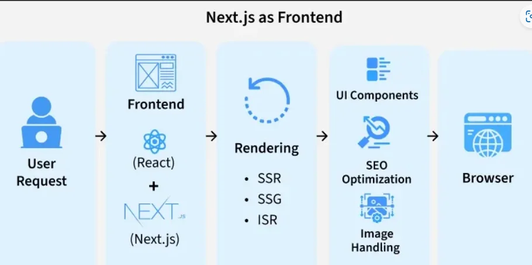
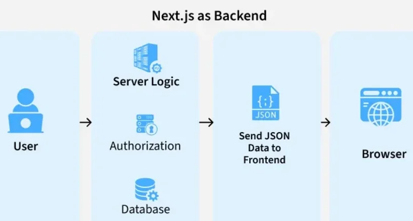
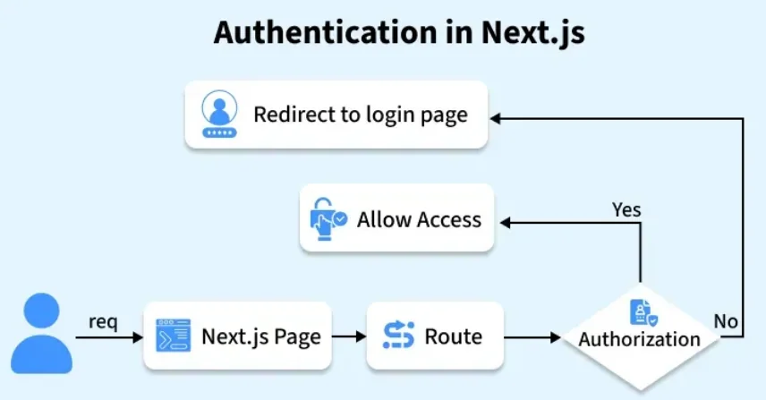

# Project folder Structure

## React + Vite + Backend (firebase/node)

```
my-fullstack-app/
│
├── client/ # Frontend (React + Vite)
│ ├── public/
│ ├── src/
│ │ ├── assets/ # images, fonts
│ │ ├── components/ # reusable UI components
│ │ ├── pages/ # route-based pages
│ │ ├── hooks/ # custom hooks
│ │ ├── services/ # API calls (axios/fetch)
│ │ ├── context/ # global state (Context API)
│ │ ├── App.jsx
│ │ └── main.jsx
│ ├── index.html
│ ├── vite.config.js
│ └── package.json
│
├── server/ # Backend (Node.js + Express)
│ ├── config/ # DB config, env setup
│ │ └── db.js
│ ├── controllers/ # business logic
│ ├── models/ # MongoDB schemas
│ ├── routes/ # API routes
│ ├── middleware/ # auth, error handlers
│ ├── utils/ # helper functions
│ ├── server.js # entry point
│ └── package.json
│
├── .env # shared env (or separate for client/server)
├── .gitignore
├── README.md
│
├── firebase.json # Firebase config
├── .firebaserc
│
└── package.json # optional root scripts
```

---

## Next JS

## 🔹 Key Differences from Vite

1. **No separate `client` folder usually**
    - Next.js projects put **frontend and backend (API routes)** in the same repo.
    - Pages and API routes are inside `/app` or `/pages` depending on Next 13+.

2. **Built-in API routes**
    - `server/` folder not required for most use-cases.
    - Backend logic goes into `/app/api/` or `/pages/api/`.
    - Can still use external services (Firebase, Supabase, MongoDB) here.

3. **Static assets** (like images, logo)
    - Use `/public/` folder (like CRA/Vite)

4. **Components & Hooks**
    - Same as Vite: `/components`, `/hooks`, `/context`, `/services`

## Suggested Next.js Fullstack Folder Structure

### Compact version

```
my-nextjs-app/
├── public/                  # 🌐 Static files served directly (logos, favicon, SEO files)
│   ├── images/
│   ├── favicon.ico
│   └── robots.txt
│
├── src/
│   ├── actions/             # 🛠 Server actions (forms, mutations, server logic)
│   ├── app/                 # 🚀 App Router (pages, layouts, routing, API endpoints)
│   ├── assets/              # 📦 Images, icons, fonts, illustrations, media assets
│   ├── components/          # 🔧 Reusable UI components (buttons, layouts, forms)
│   ├── constants/           # 📌 Static configs, enums, navigation data
│   ├── context/             # 🌍 Global state providers (theme, auth, shared state)
│   ├── hooks/               # ⚡ Custom React hooks for reusable logic
│   ├── services/            # 🔌 API calls & external service integrations
│   ├── config/              # ⚙ Environment settings & application configuration
│   ├── lib/                 # 🧩 DB connections & third-party initializations
│   ├── models/              # 🗄 Database schemas / ORM models
│   ├── styles/              # 🎨 Global styles, Tailwind setup, CSS modules
│   ├── types/               # 📝 Shared TypeScript types/interfaces (optional)
│   ├── utils/               # 🧰 Helper functions (formatting, validation, helpers)
│   └── middleware/          # 🛡 Edge/server middleware (auth, redirects, logging)
│
├── tests/                   # 🧪 Unit, integration & E2E testing setup (optional)
├── stories/                 # 📖 Storybook UI documentation & visual testing (optional)
├── scripts/                 # 🏗 Automation scripts (seed DB, codegen, deployment) (optional)
├── i18n/                    # 🌐 Localization & translations (optional)
├── docs/                    # 📚 Architecture notes & project documentation (optional)
├── agents.md                # 🤖 AI assistant rules & project context (optional, added in root folder)
│
├── .env.local               # 🔑 Environment variables (secrets, API keys)
├── .gitignore               # 🚫 Ignored files/folders
├── jsconfig.json            # 📦 Absolute imports (@/components)
├── tsconfig.json            # ⚡ TypeScript configuration (optional)
├── .eslintrc.json           # 🧹 Lint rules
├── .prettierrc              # 🖌 Code formatting rules
├── next.config.mjs          # ⚙ Next.js configuration
├── postcss.config.mjs       # ⚡ PostCSS/Tailwind setup
├── tailwind.config.js       # 🎨 Tailwind customization
├── package.json             # 📦 Dependencies & npm scripts
└── README.md                # 📖 Setup guide & project overview
```

### Expanded version

```
my-nextjs-app/
│
├── public/                          # 🌐 STATIC FILES served directly to browser
│   ├── images/                      # 🖼 Hero images, logos, banners, social preview images
│   ├── favicon.ico                  # 🔖 Browser tab icon
│   └── robots.txt                   # 🤖 SEO crawler instructions
│
├── src/
│   ├── actions/                     # 🛠 Server Actions (form handling, DB mutations)
│   │   ├── authActions.js           # Authentication server logic
│   │   └── userActions.js           # User create/update/delete actions
│   │
│   ├── app/                         # 🚀 App Router: pages, layouts, API routes
│   │   ├── (auth)/                  # Route group for auth pages (/login, /signup)
│   │   │   └── login/page.jsx       # Login page route
│   │   ├── api/                     # Backend endpoints & webhooks
│   │   │   └── stripe-webhook/route.js # Payment webhook handler
│   │   ├── layout.jsx               # Root layout (providers, metadata, HTML shell)
│   │   └── page.jsx                 # Landing/Home page
│   │
│   ├── assets/                      # 📦 Static UI assets reused across app
│   │   ├── icons/                   # SVG icons, UI icons, brand icons
│   │   └── fonts/                   # Local fonts, typography assets
│   │                                    # Logos, illustrations, tab icons, media files
│   │
│   ├── components/                  # 🔧 Reusable UI components across pages
│   │   ├── forms/                   # LoginForm, SignupForm, multi-step forms
│   │   ├── layout/                  # Navbar, Footer, Sidebar, PageLayout
│   │   └── ui/                      # Button, Input, Modal, Card, Badge
│   │                                    # Modular design → easier reuse & maintenance
│   │
│   ├── constants/                   # 📌 Static configuration/data
│   │   └── navLinks.js              # Navigation menus, static labels, enums
│   │
│   ├── context/                     # 🌍 React Context global state management
│   │   └── ThemeProvider.jsx        # Theme/auth/global providers
│   │                                    # Avoids prop drilling between components
│   │
│   ├── hooks/                       # ⚡ Custom reusable React hooks
│   │   ├── useDebounce.js           # Input debounce logic
│   │   └── useMediaQuery.js         # Responsive screen detection
│   │                                    # Separates business logic from UI
│   │
│   ├── lib/                         # 🔌 Third-party integrations & setups
│   │   ├── dbConnect.js             # Database connection helper
│   │   ├── supabase.js              # Supabase client setup
│   │   └── firebase.js              # Firebase initialization
│   │
│   ├── models/                      # 🗄 Database schemas / ORM models
│   │   ├── User.js                  # User schema/model
│   │   └── Post.js                  # Post/content schema
│   │
│   ├── styles/                      # 🎨 Styling system for application
│   │   └── globals.css              # Global styles & Tailwind directives
│   │                                    # CSS Modules & scoped component styles
│   │
│   ├── types/                       # 📝 TypeScript interfaces & shared types (optional)
│   │   └── index.d.ts               # Global type definitions
│   │
│   ├── utils/                       # 🧰 Helper & utility functions
│   │   ├── cn.js                    # Classname merge helper
│   │   └── formatDate.js            # Date formatting utility
│   │                                    # Validation, formatting, calculations
│   │
│   └── middleware/                  # 🛡 Edge/server middleware
│       └── authMiddleware.js        # Route protection, logging, redirects
│
├── tests/                           # 🧪 Testing setup
│   ├── unit/                        # Unit tests for functions/components
│   ├── integration/                 # Feature/API integration tests
│   └── e2e/                         # End-to-end user flow testing
│                                        # Improves reliability before deployment
│
├── stories/                         # 📖 Storybook component documentation
│   └── components/
│       └── Button.stories.jsx       # Interactive UI component previews
│                                        # Visual testing & design collaboration
│
├── scripts/                         # 🏗 Project automation scripts
│   └── seedDatabase.js              # DB seeding, migrations, code generation
│                                        # Dev & deployment automation
│
├── i18n/                            # 🌐 Localization & translations
│   ├── en.json                      # English translations
│   └── fr.json                      # French translations
│                                        # Multi-language application support
│
├── docs/                            # 📚 Project documentation
│   └── architecture.md              # Architecture decisions & guidelines
│
├── agents.md                        # 🤖 AI agent rules & project context (optional, added in root folder)
│                                        # Instructions for AI coding assistants
│
├── .env.local                       # 🔑 Environment variables (secrets)
├── .gitignore                       # 🚫 Git ignored files/folders
├── jsconfig.json                    # 📦 Absolute import paths (@/components)
├── tsconfig.json                    # ⚡ TypeScript configuration (optional)
├── .eslintrc.json                   # 🧹 Linting rules
├── .prettierrc                      # 🖌 Code formatting rules
├── next.config.mjs                  # ⚙ Next.js configuration
├── postcss.config.mjs               # ⚡ PostCSS/Tailwind setup
├── tailwind.config.js               # 🎨 Tailwind customization
├── package.json                     # 📦 Dependencies & scripts
└── README.md                        # 📖 Project setup & usage guide
```

---

## 🔹 Notes on Backend Integration

| Backend Type       | Placement                     | Notes                                                                |
| ------------------ | ----------------------------- | -------------------------------------------------------------------- |
| **Firebase**       | `/services/firebase.js`       | Can host API-less backend or call Firebase functions from API routes |
| **Supabase**       | `/services/supabaseClient.js` | Client calls directly, or wrap in `/app/api` routes for SSR          |
| **MongoDB + Node** | `/models/`, `/services/`      | Use `mongoose` inside API routes for SSR/API endpoints               |

> **Key:** Next.js makes `server/` folder mostly unnecessary; all backend logic lives **next to frontend** in API routes.

---

## 🔹 Differences vs Vite Fullstack Structure

| Feature          | Vite Fullstack                | Next.js Fullstack                                |
| ---------------- | ----------------------------- | ------------------------------------------------ |
| Client folder    | `/client`                     | Root project, usually no separate folder         |
| API backend      | `/server` separate            | `/app/api` or `/pages/api` (integrated)          |
| Routing          | `react-router`                | File-based routing                               |
| SSR/SSG          | ❌                            | ✅                                               |
| Deployment       | Separate for frontend/backend | Unified (serverless / Vercel / Firebase hosting) |
| SEO              | Poor                          | Excellent, pre-rendered HTML                     |
| Components/hooks | `/src/components`             | `/components`, `/hooks` (similar)                |
| State management | `/src/context`                | `/context` (similar)                             |

## Next JS as Frontend

<br><br>

## Next JS as Backend

<br><br>

## Next Js Authentication

<br><br>
