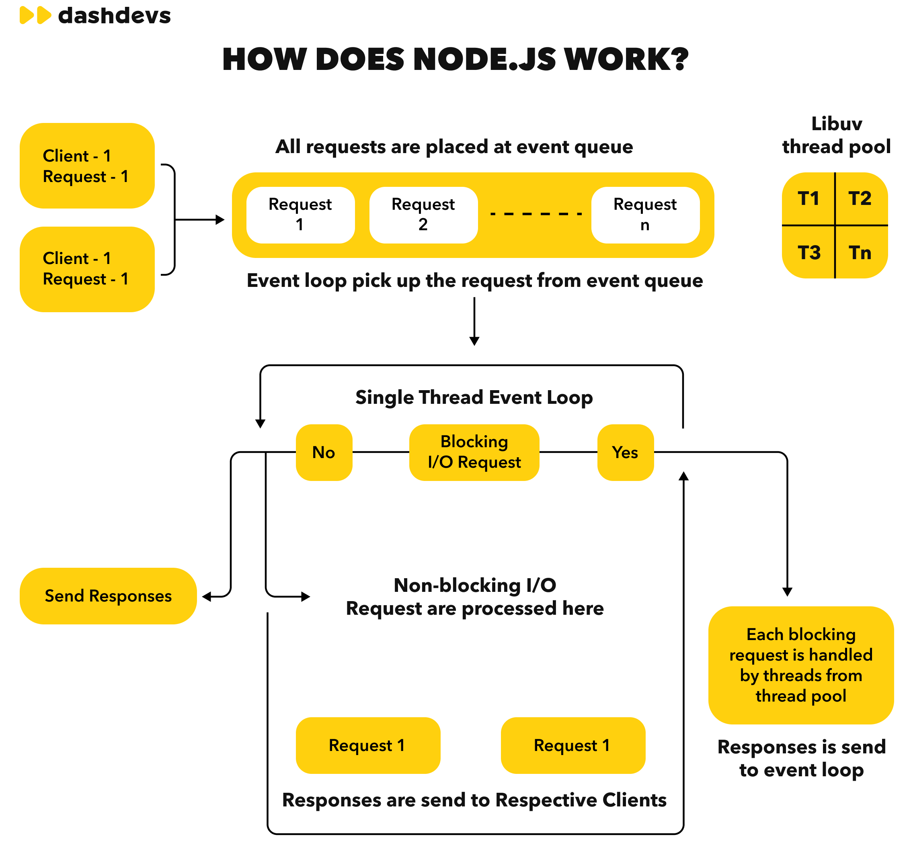

# Working of Node JS

<br><br>

Think of this diagram as the **runtime model of Node.js**—how it handles many concurrent requests using a **single thread + async I/O + background workers**

## 1. Incoming Requests → Event Queue

- Multiple clients send requests simultaneously
- Node doesn’t create a new thread per request (unlike traditional servers)
- All requests are placed into the **event queue (FIFO)**

👉 Key idea: Queue everything, process one-by-one at the JS layer

## 2. Event Loop (Single Thread)

- Node runs a **single-threaded event loop**
- It continuously:
    1. Picks the next request from the queue
    2. Executes its callback

👉 Important:

- This thread runs your **JavaScript code**
- It must **never block**, otherwise everything stalls

## 3. Decision Point: Blocking vs Non-blocking

### Case A: Non-blocking I/O (fast path) (Asynchronous)

Examples:

- Network calls (HTTP)
- File reads (async)
- DB queries (async drivers)
    ```
    fs.readFile('file.txt', (err, data) => {
    // runs later
    });
    ```

Flow:

1. Event loop delegates the operation to the OS/libuv
2. Moves on to next request immediately
3. When operation completes → callback pushed back to queue
4. Event loop processes callback → sends response

Simply,

- Event loop does NOT wait
- Task is delegated (OS or thread pool)
- Callback is executed later
- Event loop continues picking next requests

👉 Result: High concurrency with minimal threads

### Case B: Blocking / Expensive Tasks (Synchronous)

Examples:

- File system operations (some cases)
- Crypto
- Compression
- CPU-heavy work
    ```
    const data = fs.readFileSync('file.txt'); // blocks everything
    ```

Flow:

1. Event loop detects blocking work
2. Offloads it to **libuv thread pool**
3. Worker thread (T1, T2, …) executes it
4. Result returned to event loop
5. Callback queued → response sent

Simply,

- Happens on the main thread (event loop)
- The event loop waits until the task finishes
- No other request is processed during this time

👉 Default thread pool size: 4 (configurable via `UV_THREADPOOL_SIZE`)

## 4. libuv Thread Pool

- Managed by **libuv (Node’s C++ core library)**
- Handles:
    - File system ops
    - DNS (non-native)
    - Crypto
    - Some native addons

👉 Important distinction:

- **JS execution = single thread**
- **Heavy/OS tasks = thread pool**

## 5. Response Phase

- Once the callback is ready:
    - Event loop executes it
    - Response is sent to the respective client

👉 Order is not strictly request order; it’s **completion order**

## 6. Why This Model Scales

- No thread-per-request overhead
- Minimal context switching
- Efficient for I/O-heavy workloads

👉 That’s why Node excels at:

- APIs
- Real-time apps (WebSockets)
- Streaming services

## 7. Where It Breaks (Important for Interviews)

- CPU-heavy tasks block the event loop
- Example: large JSON parsing, image processing

👉 Solution:

- Use **Worker Threads**
- Or move heavy work to separate services

### Mental Model

- **Queue → Event Loop → Delegate → Callback → Response**
- Single thread orchestrates, not executes everything

### One-liner Summary

Node.js is **single-threaded at the JavaScript level**, but achieves concurrency using **non-blocking I/O and a background thread pool managed by libuv**
